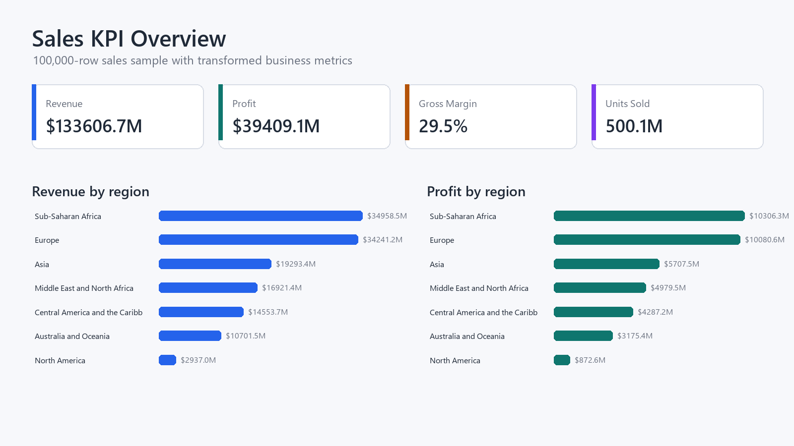
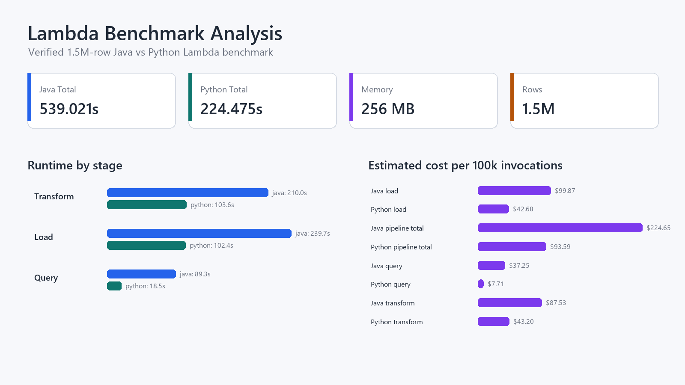

# Serverless Sales Analytics Pipeline

Cloud data engineering case study that benchmarks Java and Python AWS Lambda implementations of the same Transform-Load-Query sales analytics workflow, then turns the transformed data and runtime metrics into a Tableau dashboard.

The project is designed as a resume-ready portfolio artifact: it shows serverless infrastructure, Lambda performance engineering, reproducible benchmarking, data transformation, SQL analytics, automated tests, and business-facing BI delivery in one repository.

## Portfolio Highlights

| Area | What this project demonstrates |
| --- | --- |
| Cloud engineering | AWS Lambda, S3, IAM, CloudWatch logs, and AWS CDK v2 infrastructure as code |
| Data engineering | Streaming CSV transformation, duplicate-order removal, derived business metrics, and SQLite loading |
| Performance analysis | Java vs Python Lambda benchmark with runtime, throughput, cold/warm container, memory, and estimated cost fields |
| Reliability | Unit tests for transform, load, query, SQL generation, and shared golden-file outputs |
| Analytics delivery | Tableau packaged workbook with sales KPIs, regional performance, operations, and Lambda benchmark views |

## Latest Verified Result

Benchmark configuration:

- Dataset: 1,500,000 sales records
- Lambda memory: 256 MB
- Lambda timeout: 900 seconds
- Stages: Transform, Load, Query
- Implementations: Java 17 and Python 3.12

| Implementation | Transform | Load | Query | Pipeline Total | Total Throughput |
| --- | ---: | ---: | ---: | ---: | ---: |
| Java | 210.030s | 239.651s | 89.340s | 539.021s | 2,783 rows/sec |
| Python | 103.624s | 102.385s | 18.466s | 224.475s | 6,682 rows/sec |

The optimized Python pipeline completed the verified 1.5M-row run 2.40x faster than the Java pipeline while staying inside the same 256 MB Lambda configuration.

## How It Works

1. Raw sales CSV files are uploaded to the CDK-created S3 bucket.
2. Transform Lambda streams the CSV, removes duplicate `Order ID` values, expands order priority codes, and adds `Order Processing Time` plus `Gross Margin`.
3. Load Lambda writes the transformed records into SQLite with batched inserts and Lambda-safe temporary file cleanup.
4. Query Lambda runs parameterized aggregate queries with allowlisted filters and grouping columns.
5. Benchmark runners invoke each stage, collect SAAF runtime metadata, calculate throughput and estimated Lambda cost, and write comparable Java/Python CSV outputs.
6. Analytics artifacts combine transformed sales data and benchmark summaries into a Tableau dashboard.

## Technical Decisions

- Built equivalent Java and Python Lambda handlers to make benchmark comparisons meaningful.
- Used S3 as the stage boundary so each Lambda invocation is independently testable and observable.
- Used SQLite as a compact query layer for aggregate analytics inside Lambda.
- Preserved structured query responses with `statusCode`, `aggregations`, and grouped `results`.
- Added stable benchmark IDs, implementation labels, design labels, and append-only metric history for repeatable comparison.
- Reduced memory pressure with streaming file processing, primitive duplicate tracking, smaller SQLite caches, and lower batch/buffer sizes.

## Dashboard Evidence

Dashboard artifact: [analytics/serverless_sales_analytics.twbx](analytics/serverless_sales_analytics.twbx)





Additional dashboard views:

- [Regional Performance](analytics/screenshots/regional_performance.png)
- [Operations Analysis](analytics/screenshots/operations_analysis.png)
- [Optimization Story](analytics/screenshots/optimization_story.png)

Dashboard documentation:

- [Data dictionary](analytics/data_dictionary.md)
- [Dashboard summary](analytics/dashboard_summary.md)

## Business Insights

The Tableau workbook uses a 100,000-row curated sales sample for portfolio-scale BI views:

- Revenue: $133.61B
- Profit: $39.41B
- Gross margin: 29.50%
- Units sold: 500.14M
- Average order processing time: 25.04 days

The dashboard connects engineering metrics to business questions: which regions drive revenue and margin, where fulfillment time is slowest, and which Lambda stages dominate runtime and estimated cost.

## Repository Guide

| Path | Purpose |
| --- | --- |
| [python/src](python/src) | Python Lambda handlers for Transform, Load, Query, and SAAF inspection |
| [java/src/main/java/lambda](java/src/main/java/lambda) | Java Lambda handlers for the same TLQ stages |
| [infrastructure/cdk](infrastructure/cdk) | AWS CDK TypeScript stack for S3, Lambda, IAM, and CloudWatch logs |
| [run_callservices.py](run_callservices.py) | Main benchmark runner for deployed Java and Python Lambda functions |
| [scripts/run_tlq_benchmarks.py](scripts/run_tlq_benchmarks.py) | AWS CLI-based benchmark runner for multi-size experiments |
| [tests](tests) | Python fixtures, golden outputs, and unit tests |
| [benchmark_inputs](benchmark_inputs) | Small committed benchmark inputs for local reproduction |
| [analytics](analytics) | Tableau workbook, curated dashboard CSVs, screenshots, and documentation |

## Local Verification

Install Python test dependencies:

```bash
python -m pip install -r requirements-dev.txt
```

Run Python tests:

```bash
python -m pytest
```

Run Java tests:

```bash
cd java
mvn test
```

Build the CDK app:

```bash
cd infrastructure/cdk
npm ci
npm run build
```

CI runs the Python tests, Java tests/package step, and CDK TypeScript build in [.github/workflows/ci.yml](.github/workflows/ci.yml).

## Deploy To AWS

Prerequisites:

- AWS CLI configured for the target account and region
- Node.js and npm
- Docker running locally for Java Lambda bundling
- CDK bootstrap completed in the target account and region

Deploy:

```bash
cd infrastructure/cdk
npm ci
npm run build
npm run deploy -- --outputs-file cdk-outputs.json
```

The stack creates one private S3 bucket plus six Lambda functions: Java and Python versions of Transform, Load, and Query.

To avoid function-name collisions in a shared AWS account:

```bash
npm run deploy -- --outputs-file cdk-outputs.json -c functionNamePrefix=<your-prefix>
```

## Run A Benchmark

From the repository root, run a deployed Lambda benchmark:

```bash
python run_callservices.py --language all --rows 10000 --iterations 1
```

For the verified 1.5M-row benchmark, provide the full dataset locally or upload it to S3 first:

```bash
python run_callservices.py --language all --rows 1500000 --iterations 1 --skip-upload --implementation-id deployed-java-python --design-id optimized-primitive-set-no-indexes-1500000
```

Use `--skip-upload` only after the matching CSV has already been uploaded to the CDK-created S3 bucket. Large local datasets are intentionally ignored by Git; see [data/README.md](data/README.md).

Benchmark outputs include:

- `callservice_clean_metrics.csv`
- `callservice_clean_summary.csv`
- `benchmark_results/callservice_metrics_history.csv`
- `benchmark_results/callservice_summary_history.csv`
- Legacy Java/Python CSV outputs for comparison with the original scripts

## Portfolio Talking Points

- Implemented a reproducible Java vs Python AWS Lambda benchmark for a 1.5M-row sales analytics workload under 256 MB memory constraints.
- Provisioned disposable serverless infrastructure with AWS CDK, including S3, six Lambda functions, IAM permissions, and CloudWatch log groups.
- Optimized transform/load/query stages with streaming CSV processing, duplicate detection, batched SQLite writes, parameterized SQL, and Lambda `/tmp` cleanup.
- Built a Tableau dashboard that links business KPIs with cloud runtime and cost tradeoffs.

## Future Work

- Add Go with a `provided.al2023` custom runtime.
- Benchmark 256 MB, 512 MB, and 1024 MB Lambda memory settings.
- Add Step Functions orchestration for full pipeline execution.
- Compare SQLite Lambda analytics against Athena and Glue.
- Expand dashboard cost modeling with configurable AWS pricing assumptions.
