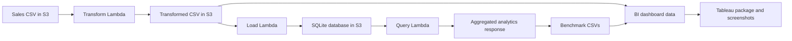

# Serverless Sales Analytics Pipeline: Java vs Python Lambda Benchmark + BI Dashboard

This project implements a serverless Transform-Load-Query sales analytics pipeline in both Java and Python on AWS Lambda, then compares runtime, throughput, memory, and estimated cost under the same benchmark workflow. The portfolio deliverable now combines cloud data engineering, Lambda performance analysis, and a BI dashboard built from transformed sales data plus benchmark metrics.

## Architecture



## Problem

The project answers two questions:

1. Can a Lambda-based TLQ pipeline process a large sales dataset reliably under a 256 MB memory setting?
2. How do Java and Python Lambda implementations compare when they perform the same transform, load, query, and benchmark steps?

## Tech Stack

- AWS Lambda, Amazon S3, CloudWatch, IAM
- Java 17, Maven, SQLite JDBC, JUnit 5
- Python 3, boto3, sqlite3, pytest
- AWS CDK v2, TypeScript
- Tableau packaged workbook artifact, curated CSV dashboard data, PNG dashboard screenshots

## Pipeline Flow

- Transform: Reads raw sales CSV data, removes duplicate order IDs, expands order priority codes, and adds `Order Processing Time` plus `Gross Margin`.
- Load: Streams the transformed CSV into SQLite with batched inserts and Lambda-safe temporary file cleanup.
- Query: Runs parameterized aggregate queries with optional filters and groupings. Java and Python now return the same response shape: `statusCode`, `aggregations`, and grouped `results`.
- Benchmark: Invokes each Lambda stage, captures SAAF runtime fields, calculates throughput and estimated Lambda cost, and writes comparable Java/Python CSVs.
- Dashboard: Uses transformed sales data and Lambda benchmark summaries for KPI, regional, operations, benchmark, and optimization views.

## Key Benchmark Result

Latest verified 1.5M-row benchmark, 256 MB Lambda memory:

| Language | Transform | Load | Query | Total |
| --- | ---: | ---: | ---: | ---: |
| Java | 210.030s | 239.651s | 89.340s | 539.021s |
| Python | 103.624s | 102.385s | 18.466s | 224.475s |

The current optimized Python pipeline completed the verified run 2.40x faster than the Java pipeline. Both implementations completed under the 900-second Lambda timeout.

## Dashboard Evidence

Dashboard artifact: [analytics/serverless_sales_analytics.twbx](analytics/serverless_sales_analytics.twbx)


Additional dashboard screenshots:

- [Regional Performance](analytics/screenshots/regional_performance.png)
- [Operations Analysis](analytics/screenshots/operations_analysis.png)
- [Optimization Story](analytics/screenshots/optimization_story.png)

Dashboard documentation:

- [Data dictionary](analytics/data_dictionary.md)
- [Dashboard summary](analytics/dashboard_summary.md)

## Business Insights

- The 100,000-row dashboard sample contains $133.61B in revenue, $39.41B in profit, and a 29.50% gross margin.
- Average order processing time is 25.04 days across the sample.
- Regional and country views expose where revenue concentration, profit concentration, and processing delays differ.
- Lambda benchmark views show that runtime and estimated cost are driven most by Transform and Load, not Query.

## Deployment

Prerequisites:

- AWS CLI configured for the target account and region.
- Node.js and npm.
- Docker for CDK Java Lambda bundling.
- AWS CDK bootstrap completed in the account/region.

Deploy:

```bash
cd infrastructure/cdk
npm ci
npm run build
npm run deploy
```

The CDK stack outputs the S3 bucket and Lambda function names used by the benchmark runner.

## Benchmark

Run a local benchmark against deployed Lambda functions:

```bash
python run_callservices.py --language all --rows 1500000 --iterations 1 --skip-upload --implementation-id deployed-java-python --design-id optimized-primitive-set-no-indexes-1500000
```

Use `--skip-upload` only after the matching CSV has already been uploaded to the CDK-created S3 bucket. Large local datasets are intentionally ignored by Git; see [data/README.md](data/README.md).

## Tests

Python:

```bash
python -m pytest
```

Java:

```bash
cd java
mvn test
```

CDK:

```bash
cd infrastructure/cdk
npm ci
npm run build
```

CI runs all three paths in [.github/workflows/ci.yml](.github/workflows/ci.yml).

## Lessons Learned

- Streaming CSV processing and batched SQLite writes matter more than language choice alone under tight Lambda memory limits.
- Benchmark CSVs need stable record IDs, comparable columns, and per-stage cost estimates to support fair runtime comparisons.
- Query handlers should expose structured aggregations rather than language-specific string payloads.
- A cloud benchmark is easier to explain when paired with a business-facing analytics deliverable.

## Future Work

- Add Go with a `provided.al2023` custom runtime.
- Benchmark 256 MB, 512 MB, and 1024 MB Lambda memory settings.
- Add Step Functions orchestration.
- Add Athena/Glue as a cloud-native analytics path.
- Expand the cost dashboard with AWS pricing assumptions.
